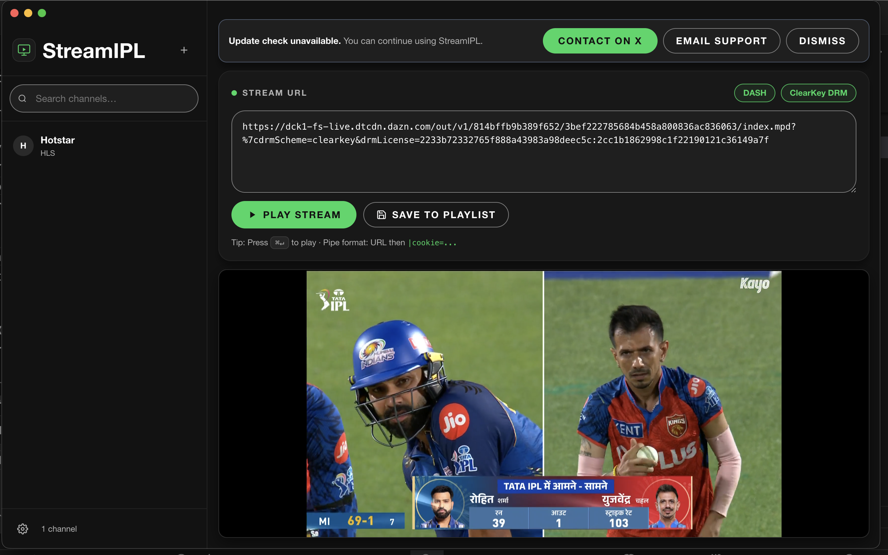

# StreamIPL — IPTV Player for macOS

A native macOS IPTV player with HLS/DASH playback, ClearKey DRM, pipe-format playlist URLs, and automatic update notifications.

> [!IMPORTANT]
> **macOS says "StreamIPL is damaged"?** This is a Gatekeeper quarantine flag — the app is fine.
> Open **Terminal** and run:
> ```bash
> xattr -d com.apple.quarantine /Applications/StreamIPL.app
> ```
> Then double-click the app. Done. See [Installation](#installation) for details.

## Preview


## Features
- HLS and DASH playback (`.m3u8`, `.mpd`)
- ClearKey DRM support
- Pipe-format URL parsing with cookie and header injection
- Playlist management (save, delete, search, load)
- 60-second catch-up buffer for smoother live viewing
- `-60s` quick replay control in player controls
- In-app release update notification from GitHub Releases
- Manual Inspect/DevTools toggle from Settings
- Apple-style dark desktop UI theme

## Download
[](https://github.com/sanchit339/StreamIPL-release/releases/latest)

Head to the [Releases](https://github.com/sanchit339/StreamIPL-release/releases/latest) page and download the build for your Mac's chip:

| File | Chip |
|------|------|
| `StreamIPL-x.x.x-arm64.dmg` | Apple Silicon (M1 / M2 / M3 / M4) |
| `StreamIPL-x.x.x-x64.dmg` | Intel |

> **Why separate files?** Universal binaries (single DMG for both chips) that are unsigned trigger macOS Gatekeeper's "damaged app" error on modern macOS versions. Distributing architecture-specific builds avoids this completely.

## Installation
1. Download the `.dmg` for **your chip** (see table above).
2. Open the `.dmg` and drag **StreamIPL** to `/Applications`.
3. Open **Terminal** and run the quarantine-removal command:
   ```bash
   xattr -d com.apple.quarantine /Applications/StreamIPL.app
   ```
4. Launch StreamIPL from Launchpad or Spotlight.

> [!NOTE]
> **Why is this needed?** StreamIPL is unsigned. macOS quarantines every app downloaded from the internet that lacks an Apple Developer signature. The `xattr` command removes that quarantine flag — it does not disable any security features.
>
> Alternatively: **System Settings → Privacy & Security → scroll down → Open Anyway** (appears only after a blocked launch attempt).


## Usage
1. Paste a valid HLS/IPTV URL (plain `.m3u8` or pipe-format) in the URL bar.
2. Press **Play** or hit `Enter`.
3. Save channels to playlist for quick access.
4. Use `-60s` in player controls to replay recent action.

### Supported URL Formats
| Format | Example |
|--------|---------|
| Plain HLS | `https://example.com/stream.m3u8` |
| Pipe format | `https://stream.m3u8|cookie=foo=bar&drm_key=abc123` |
| DASH + ClearKey | `https://example.com/live.mpd|drmScheme=clearkey&drmLicense=KEYID:KEY` |

## Update Notifications
StreamIPL checks GitHub Releases on startup and shows an update banner when a newer version is available.

When an update is found, click **Update now** to open this releases page.
If update checks fail (network/rate-limit/API error), playback is not affected and you can always download manually from the [Releases](https://github.com/sanchit339/StreamIPL-release/releases) page.

## Source Code
The source code for StreamIPL is **private**. Only compiled binaries are distributed here through the official release channel.

## Reporting Issues & Feedback
Please use the [Issues](https://github.com/sanchit339/StreamIPL-release/issues) tab to report bugs or request features. Include:
- macOS version (e.g. Sonoma 14.x)
- Mac chip (Apple Silicon or Intel)
- StreamIPL version (visible in Settings)
- Steps to reproduce the issue

## Tech Stack
- [Electron](https://www.electronjs.org/)
- [React](https://react.dev/) + [Vite](https://vitejs.dev/)
- [hls.js](https://github.com/video-dev/hls.js)
- [Shaka Player](https://github.com/shaka-project/shaka-player)
- [Zustand](https://github.com/pmndrs/zustand)

## License
Copyright © 2024 StreamIPL. All Rights Reserved.

This software is distributed as a compiled binary for personal, non-commercial use only. Redistribution, modification, reverse engineering, or repackaging is not permitted.
